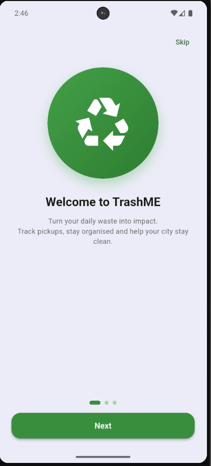
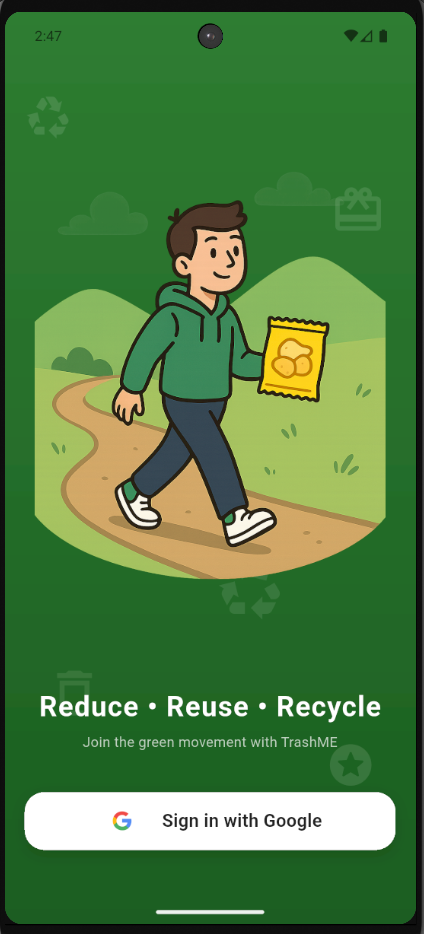
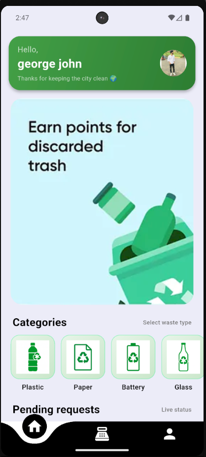
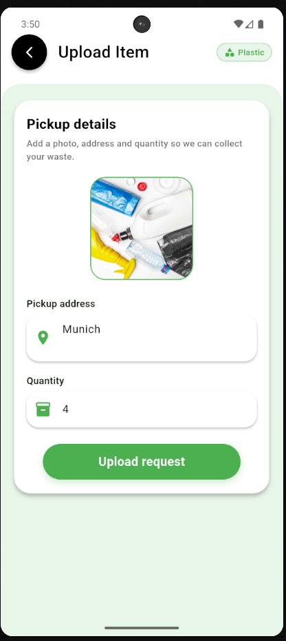
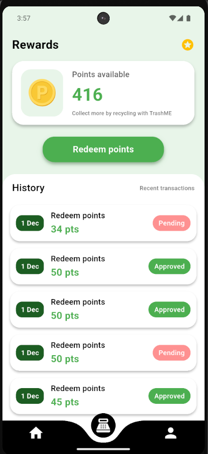
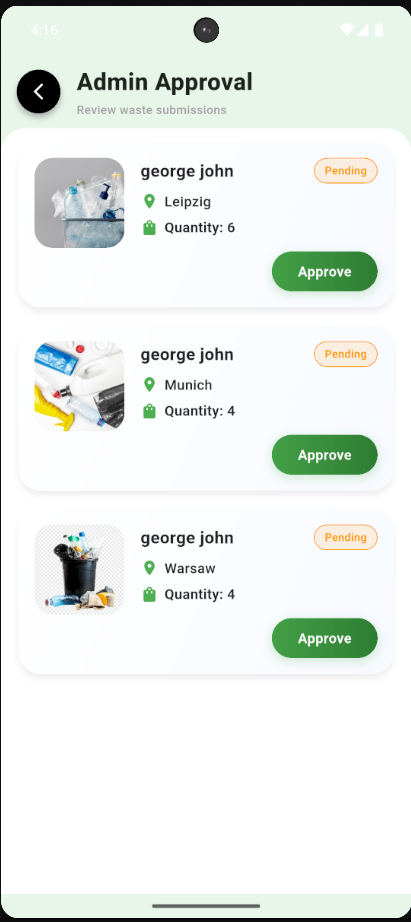
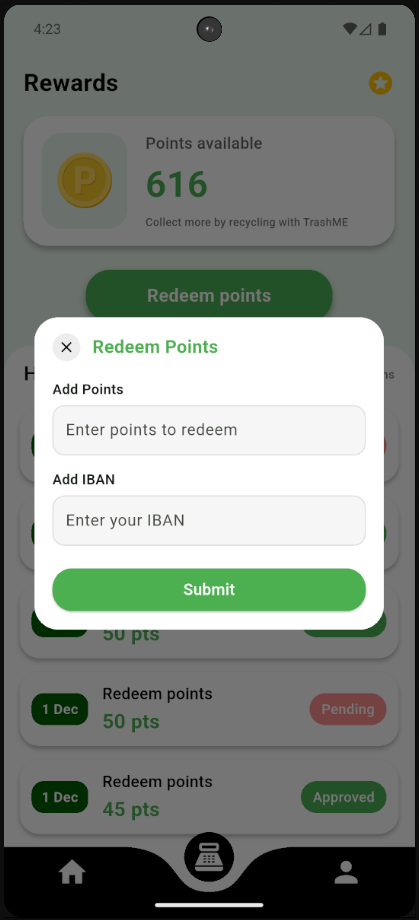
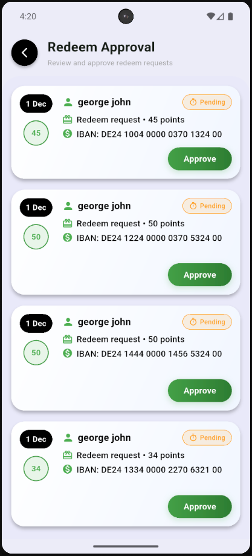

# ♻️ TrashME — Smart Recycling App

“Thrilled to share my latest project — TrashME, a smart recycling app built using Flutter & Firebase.”

TrashME is a mobile app that encourages responsible waste disposal by rewarding users for recycling.  
Users can upload waste items, earn points, and even convert those points into cash via IBAN payout — all through a clean and intuitive interface.

---

## 🚀 Features

- 🔐 **Authentication**
  - Email/password login(for Admin)
  -  Google Sign-In integration(For users)

- 🧺 **Waste Upload**
  - Upload waste items with images
  - Support for categories: **plastic, glass, paper, battery**
  - Store item data in Firestore

- 🎯 **Points & Rewards**
  - Earn points for each approved waste item
  - Real-time points tracking
  - **Convert points to cash using IBAN payout**

- 🧾 **Admin Panel**
  - View all user requests
  - Approve / reject waste submissions
  - Update request status in real time

- 🖼️ **UI & UX**
  - Custom icons for each waste category
  - Clean, responsive layout
  - Smooth animations and transitions

---

## 🛠 Tech Stack

- **Framework:** Flutter (Dart)
- **Backend:** Firebase
  - Firebase Authentication
  - Cloud Firestore
  - Firebase Storage
- **Local Storage:** SharedPreferences
- **Architecture:** Widget-based with Streams for real-time updates

---

## 📱 Main Screens

- Splash screen / Logo
- Login screen
- Home / Dashboard (waste categories)
- Upload item screen (image + details)
- Points / Wallet screen (with IBAN payout option)
- Admin approval screen (pending / approved / rejected)

---
---

## 📸 Screenshots

### Main Screens

| Splash | Login | Home |
|--------|--------|-------|
|  |  |  |

| Upload | Wallet (IBAN) | Admin |
|--------|----------------|--------|
|  |  |  |

---

### Additional Screens

| Wallet Alt | Admin Alt |
|-------------|-----------|
|  |  |

